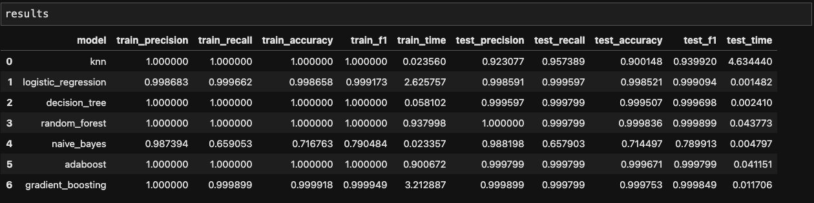

# Machine Learning in Aviation 

**Authors**: [Robert Reynoso](mailto:robert@birdstop.io)

## Overview

With my background in aeronautics I wanted to apply my new Machine Learning (ML) skills to my passion and industry. Using data provided by the National Transportation Safety Board (NTSB), I wanted to discover if ML can help in increasing safety or provide more insights into the factors that contribute to a safe flight. 

## Business Problem

Using ML specifically supervised learning. 
Can we use classification algorithms to classify past aviation accidents as fatal or non-fatal based on features of that accident?


## Data

* In the industry, data can be obtained and requested through the FAA and NTSB.

* The data set used in this project was provided by the NTSB and pulled from Kaggle.

## Methods

* Data Wrangling & EDA Was conducted using Seaborn, Matplotlib, Pandas, and Numpy.

* Model Construction

Given the business problem, a binary classification was used. Model creation was used using the python Sci-kit learn library.
Using a function to test multiple models. 7 final models were used. KNN, logistic regression, decision tree, random forest, naive bayes, adaboost, and gradient boosting. The best perfoming out of the 7 models was random forest. 

* Preprocessing pipelines

Test-Train-Split was utilized to set aside the test set, with a 20% test size.

GridSearchCV was utilized to perform a 5 fold cross validation over the selected parameters.


* Performance metrics

Accuracy score was utilized for the models.


## Results



* These were the 7 vanilla models that were used

* Final model - Random Forest


* X Train results:


* X Test results:


### Analysis 

* Percentages of fatal vs non-fatal accidents


* Model performance was high due to these features. Further inspection to be done on fatality percentage.


* Most accidents in this data set. Further inspection into why or narrow modeling into these makes only. 


## Conclusions


1. Successfully ran 7 vanilla ML models to learn how we can improve aviation safety. 

2. The above models returned acceptable model performance.

3. Through initial classification modeling, we learned  which features are important in classifying a fatal or non-fatal aviation accident.

4. Although we can classify a accident with good model performance. Further investigation and feature engineering is required  on the fatality_percentage feature.


## Next Steps

1. Find or create more data specifically in the aircraft_damage category 

2. Use imputation to replace any unknown data

3. Productionize model with prediction function

4. Look into multiclass classification to improve model accuracy


## For More Information

Please review our full analysis in [our Jupyter Notebooks](./notebooks) or our [presentation](https://github.com/reynoso811/ML_Aviation_Safety/blob/main/ML%20in%20Aviation%20Safety.pdf).

For any additional questions, please contact **Robert Reynoso & robert@birdstop.io**

## Repository Structure


```
├── README.md                           <- The top-level README for reviewers of this project
├── Jupyter notebooks                   <- Narrative documentation of analysis in Jupyter notebook
├── ML in Aviation Safety.pdf           <- PDF version of project presentation
├── data                                <- Both sourced externally and generated from code
└── images                              <- Both sourced externally and generated from code
```
